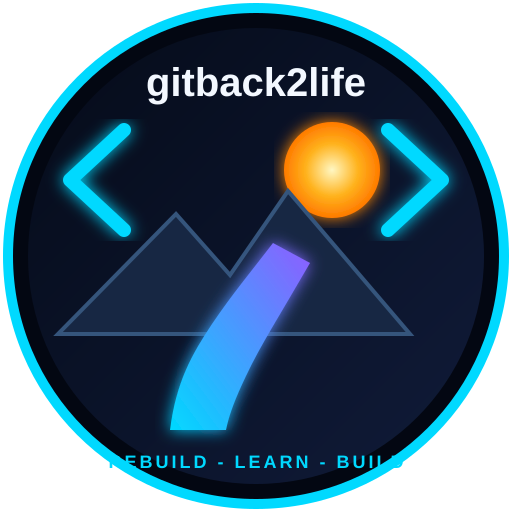

# gitback2life

**Rebuild. Learn. Build. Become independent.**

> **Rebuilding a life, one line of code at a time.**

gitback2life is a pseudonymous personal rebuilding project documenting the process of moving from a long period of disability toward greater independence using AI, learning, software development, and practical problem-solving.

## The visual idea

The project's identity is a cyber-tech comeback story:

- **Sunrise** — a new beginning
- **Mountains** — the climb ahead
- **Backpack** — carrying the past forward
- **Code** — the tool
- **Road / arrow** — movement toward independence
- **Neon light** — energy, technology, and possibility

## Objectives

1. Maintain legitimate access to useful AI tools.
2. Build a public but privacy-preserving project identity.
3. Document real software and learning progress.
4. Explore legitimate, $0-upfront-cost income opportunities.
5. Reduce and ultimately eliminate the need for outside support.

## Current assets

- Dedicated project email
- gitback2life project identity
- Existing AI-assisted task-management application
- Public starter website
- Privacy, scam-screening, support, brand, and progress documents

## Repository structure

- index.html — self-contained public project website
- assets/gitback2life-mark.svg — reusable brand mark
- docs/project-outline.md — master project plan
- docs/brand-guide.md — visual and voice standards
- docs/social-bios.md — platform-ready bios
- docs/privacy.md — privacy checklist
- docs/scam-checklist.md — opportunity/support scam screening
- docs/platform-matrix.md — researched platform notes
- docs/progress.md — ongoing progress log
- docs/support-request.md — draft support request
- docs/website-roadmap.md — site evolution plan
- docs/session-handoff.md — canonical session context and research-separation guide
- docs/ideas-and-requests.md — public suggestion and build-request process
- .github/ISSUE_TEMPLATE/idea.yml — public idea form
- .github/ISSUE_TEMPLATE/request.yml — public build-request form
- projects/task-manager/README.md — existing task-management project documentation

## Important

This repository is intended to remain truthful and pseudonymous. Do not commit secrets, personal contact information, API keys, passwords, payment information, government documents, or private medical records.

Platform policies and OpenAI support methods can change. Re-check official rules before publishing a request or initiating a transaction.

## Help shape what gets built

The public website now includes structured GitHub issue forms for **ideas** and **build requests**. Useful community suggestions can become future experiments, software builds, learning exercises, or case studies.

Public submissions should never include private or identifying information.
